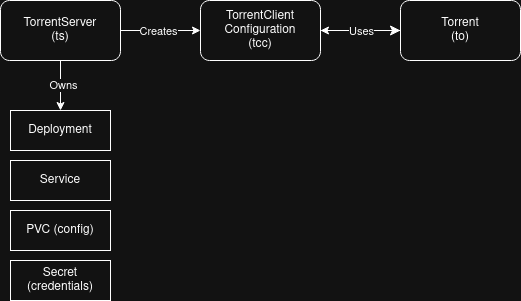

# qBittorrent Operator

A Kubernetes operator that manages qBittorrent server deployments and torrent downloads through Custom Resource Definitions (CRDs). Deploy a fully managed qBittorrent instance and declaratively manage torrents — no manual UI interaction required.

Check the [Usage Examples](#usage-examples) for a full working environment.

## Table of Contents

- [How It Works](#how-it-works)
- [Custom Resource Definitions](#custom-resource-definitions)
- [Compatibility](#compatibility)
- [qBittorrent API Reference](#qbittorrent-api-reference)
- [Installation](#installation)
- [Usage Examples](#usage-examples)
- [Monitoring](#monitoring)
- [Troubleshooting](#troubleshooting)

## How It Works

The qBittorrent Operator introduces three Custom Resource Definitions that work together:

1. **TorrentServer** (`ts`) — Deploys and manages a qBittorrent server instance (Deployment, Service, PVC, credentials Secret), and automatically creates a TorrentClientConfiguration for it.
2. **TorrentClientConfiguration** (`tcc`) — Holds connection details (URL + credentials) for a qBittorrent instance. Created automatically by TorrentServer, or manually for external servers. The related controller validates connectivity towards the qBittorrent server reporting Available/Degraded state.
3. **Torrent** (`to`) — Represents a single torrent download. Discovers which qBittorrent server to use via TCC (explicit reference or auto-discovery). The related controller manages torrent lifecycle via qBittorrent APIs.

### Architecture



**Key design**: TorrentServer auto-creates a TCC. Torrent always resolves through TCC, making TCC the universal abstraction for "how to connect to a qBittorrent server." This supports both managed servers (TorrentServer) and external servers (manual TCC).

### Credential Pre-Seeding (Init Container)

(You can skip this section as the process is completely handled by the TorrentServer controller. Keeping here just for implementation documentation.)

qBittorrent v4.6.1+ no longer accepts externally-set default credentials. On first boot, it generates a random password and logs it to the console, which means operator-managed credentials would not match what qBittorrent actually uses.

To solve this, TorrentServer Deployments include an **init container** that pre-seeds the qBittorrent config file with the operator-managed credentials before qBittorrent starts:

```
Pod startup:
  1. Init container (config-init):
     - Checks if /config/qBittorrent/qBittorrent.conf already exists
     - If not: reads credentials from the Secret, hashes the password
       using PBKDF2-HMAC-SHA512 (qBittorrent's native format), and
       writes a minimal config file
     - If config exists: exits immediately (no-op)
  2. Main container: qBittorrent starts with pre-seeded credentials
```

The init container reuses the operator binary (`/manager config-init`), so no additional image is needed. It runs as root (required for PVC write access) but with hardened security: no privilege escalation, all capabilities dropped, read-only root filesystem. It only runs on first boot — subsequent pod restarts skip it because the config already exists.

### Controller Logic

Each controller follows the standard Kubernetes reconciliation pattern:

| Controller | Watches | Creates/Manages |
|---|---|---|
| **TorrentServer** | TorrentServer | Deployment, Service, PVC, Secret, TCC |
| **TorrentClientConfiguration** | TCC, Secrets | Status conditions (Available/Degraded) |
| **Torrent** | Torrent, TCC | Torrent lifecycle in qBittorrent via API |

## Custom Resource Definitions

### TorrentServer (shortName: `ts`)

Manages a qBittorrent server deployment and all its supporting resources.

```yaml
apiVersion: torrent.qbittorrent.io/v1alpha1
kind: TorrentServer
metadata:
  name: qbittorrent
  namespace: media-server
spec:
  image: lscr.io/linuxserver/qbittorrent:amd64-5.1.4
  resources:
    limits:
      memory: 250Mi
    requests:
      memory: 200Mi
  env:
    - name: PUID
      value: "0"
    - name: PGID
      value: "0"
    - name: UMASK
      value: "022"
  configStorage:
    size: "1Gi"
  downloadVolumes:
    - claimName: media-pvc
      mountPath: /downloads/media
  # Optional: reference an existing credentials Secret.
  # If omitted, a Secret with auto-generated credentials is created.
  # credentialsSecret:
  #   name: qbittorrent-credentials
```

#### TorrentServer Spec Fields

| Field | Type | Required | Default | Description |
|-------|------|----------|---------|-------------|
| `image` | string | No | `lscr.io/linuxserver/qbittorrent:amd64-5.1.4` | qBittorrent container image |
| `replicas` | int32 | No | `1` | Number of replicas (0 or 1) |
| `resources` | ResourceRequirements | No | — | CPU/memory requests and limits |
| `env` | []EnvVar | No | — | Extra environment variables (PUID, PGID, etc.) |
| `configStorage` | StorageSpec | No | 1Gi / ReadWriteOnce | PVC spec for the `/config` volume |
| `downloadVolumes` | []DownloadVolumeSpec | No | — | Existing PVCs to mount as download directories |
| `credentialsSecret` | SecretReference | No | Auto-generated | Secret with `username` and `password` keys |
| `serviceType` | string | No | `ClusterIP` | Kubernetes Service type (ClusterIP, NodePort, LoadBalancer) |
| `webUIPort` | int32 | No | `8080` | qBittorrent WebUI port |

#### TorrentServer Status Fields

| Field | Type | Description |
|-------|------|-------------|
| `deploymentName` | string | Name of the managed Deployment |
| `serviceName` | string | Name of the managed Service |
| `configPVCName` | string | Name of the managed config PVC |
| `credentialsSecretName` | string | Name of the credentials Secret in use |
| `clientConfigurationName` | string | Name of the auto-created TCC |
| `readyReplicas` | int32 | Number of ready replicas |
| `url` | string | Internal service URL for the WebUI |
| `conditions` | []Condition | Available / Degraded conditions |

#### Owned Resources

TorrentServer creates and owns (via owner references) the following resources — they are garbage-collected when the TorrentServer is deleted:

- **Deployment** — runs the qBittorrent container
- **Service** — exposes the WebUI
- **PVC** — config storage (`/config`)
- **Secret** — WebUI credentials (only if auto-generated)
- **TorrentClientConfiguration** — connection config for Torrent resources

**Download PVCs are NOT owned**. They reference pre-existing PVCs and are not deleted when the TorrentServer is removed.

---

### TorrentClientConfiguration (shortName: `tcc`)

Defines how to connect to a qBittorrent instance. The controller validates connectivity and reports status.

```yaml
# Example: Manual TCC for an external qBittorrent server
apiVersion: torrent.qbittorrent.io/v1alpha1
kind: TorrentClientConfiguration
metadata:
  name: external-qbittorrent
  namespace: media-server
spec:
  url: "http://qbittorrent.media-server.svc.cluster.local:8080"
  credentialsSecret:
    name: qbittorrent-credentials
  timeout: "10s"
  checkInterval: "60s"
```

#### TCC Spec Fields

| Field | Type | Required | Default | Description |
|-------|------|----------|---------|-------------|
| `url` | string | Yes | — | qBittorrent WebUI URL (must start with `http://` or `https://`) |
| `credentialsSecret` | SecretReference | Yes | — | Secret containing `username` and `password` keys |
| `timeout` | string | No | `10s` | HTTP client timeout |
| `checkInterval` | string | No | `60s` | Health check interval |

#### TCC Status Fields

| Field | Type | Description |
|-------|------|-------------|
| `connected` | bool | Whether the operator can reach qBittorrent |
| `lastChecked` | Time | Timestamp of the last connectivity check |
| `qbittorrentVersion` | string | Version reported by the qBittorrent instance |
| `conditions` | []Condition | Available / Degraded conditions |

---

### Torrent (shortName: `to`)

Represents a single torrent download managed via the qBittorrent API.

```yaml
apiVersion: torrent.qbittorrent.io/v1alpha1
kind: Torrent
metadata:
  name: big-buck-bunny
  namespace: media-server
spec:
  magnet_uri: "magnet:?xt=urn:btih:dd8255ecdc7ca55fb0bbf81323d87062db1f6d1c&dn=Big+Buck+Bunny"
  # Uses auto-discovery: finds the single TCC in the namespace.
  # To explicitly reference a TCC, uncomment:
  # clientConfigRef:
  #   name: qbittorrent-client-config
  deleteFilesOnRemoval: true
```

#### Torrent Spec Fields

| Field | Type | Required | Default | Description |
|-------|------|----------|---------|-------------|
| `magnet_uri` | string | Yes | — | Magnet URI for the torrent |
| `clientConfigRef` | LocalObjectReference | No | Auto-discovery | Explicit reference to a TCC in the same namespace |
| `deleteFilesOnRemoval` | bool | No | `true` | Delete downloaded files when the Torrent resource is deleted |

**Client discovery**: If `clientConfigRef` is not set, the controller lists all TCCs in the namespace. If exactly one exists, it is used automatically. If zero or multiple exist, the Torrent enters a Degraded state.

#### Torrent Status Fields

| Field | Type | Description |
|-------|------|-------------|
| `content_path` | string | Absolute path where torrent content is stored |
| `added_on` | int64 | Unix timestamp when torrent was added |
| `state` | string | Current torrent state (see [Torrent States](#torrent-states)) |
| `total_size` | int64 | Total size in bytes |
| `name` | string | Display name of the torrent |
| `time_active` | int64 | Total active time in seconds |
| `amount_left` | int64 | Bytes remaining to download |
| `hash` | string | Unique torrent hash identifier |
| `clientConfigurationName` | string | Resolved TCC name being used |
| `conditions` | []Condition | Available / Degraded conditions |

#### Torrent States

| State | Description |
|-------|-------------|
| `downloading` | Actively downloading |
| `uploading` | Seeding (uploading to peers) |
| `pausedDL` | Download is paused |
| `pausedUP` | Upload/seeding is paused |
| `queuedDL` | Queued for download |
| `queuedUP` | Queued for upload |
| `stalledDL` | Download stalled (no peers) |
| `stalledUP` | Upload stalled (no peers) |
| `checkingDL` | Checking download integrity |
| `checkingUP` | Checking upload integrity |
| `error` | Error occurred |
| `missingFiles` | Torrent files are missing |

## Compatibility

### Tested qBittorrent Images

| Image | qBittorrent Version | API Version | Status |
|-------|---------------------|-------------|--------|
| `lscr.io/linuxserver/qbittorrent:amd64-5.1.4` | 5.1.4 | v2.8.3 | Tested, Default |

The operator is tested against the [LinuxServer.io qBittorrent image](https://docs.linuxserver.io/images/docker-qbittorrent/). Other images that expose the qBittorrent Web API v2 should work but are not officially tested.

**Note**: qBittorrent v4.6.1+ changed credential handling — first boot generates a random password instead of using the default `adminadmin`. The operator handles this automatically via the [init container](#credential-pre-seeding-init-container).

## qBittorrent API Reference

The operator uses the [qBittorrent Web API v2](https://github.com/qbittorrent/qBittorrent/wiki/WebUI-API-(qBittorrent-4.1)) (tested with v2..8.3). Key endpoints used:

### Authentication
- `POST /api/v2/auth/login` — Authenticate and get session cookie

### Torrent Management
- `GET /api/v2/torrents/info` — Get list of all torrents
- `POST /api/v2/torrents/add` — Add new torrent via magnet URI
- `POST /api/v2/torrents/delete` — Remove torrent by hash

## Installation

### Prerequisites

- Kubernetes cluster (v1.20+)
- kubectl configured

If you want to build from source:
- Docker (to build images)
- Go 1.25+ (for development)

### Install the Operator

#### Option 1: Using Kustomize (Recommended)

```bash
git clone https://github.com/guidonguido/qbittorrent-operator
cd qbittorrent-operator

kubectl apply -k config/default/
```

#### Option 2: Using Make Targets

```bash
git clone https://github.com/guidonguido/qbittorrent-operator
cd qbittorrent-operator

# Install CRDs
make install

# Deploy the operator
make deploy IMG=controller:latest
```

#### Option 3: Using Install Manifest

```bash
git clone https://github.com/guidonguido/qbittorrent-operator
cd qbittorrent-operator

# Generate single install file
make build-installer IMG=controller:latest

# Apply the generated manifest
kubectl apply -f dist/install.yaml
```

**Verify installation**:
```bash
kubectl get pods -n qbittorrent-operator-system
kubectl get crd torrentservers.torrent.qbittorrent.io
kubectl get crd torrentclientconfigurations.torrent.qbittorrent.io
kubectl get crd torrents.torrent.qbittorrent.io
```

### Build from Source

```bash
git clone https://github.com/guidonguido/qbittorrent-operator
cd qbittorrent-operator

make docker-build IMG=qbittorrent-operator:latest
make deploy IMG=qbittorrent-operator:latest
```

## Usage Examples

### Managed Server (Recommended)

Deploy a fully managed qBittorrent server and start downloading torrents:

```yaml
# 1. Create namespace and download PVC
apiVersion: v1
kind: Namespace
metadata:
  name: media-server
---
apiVersion: v1
kind: PersistentVolumeClaim
metadata:
  name: media-pvc
  namespace: media-server
spec:
  # storageClassName: cinder or based on CSI     # Specify if needed
  accessModes: [ReadWriteOnce]
  resources:
    requests:
      storage: 100Gi
---
# 2. Deploy qBittorrent via TorrentServer
apiVersion: torrent.qbittorrent.io/v1alpha1
kind: TorrentServer
metadata:
  name: qbittorrent
  namespace: media-server
spec:
  image: lscr.io/linuxserver/qbittorrent:amd64-5.1.4
  env:
    - name: PUID
      value: "0"
    - name: PGID
      value: "0"
  configStorage:
    size: "1Gi"
  downloadVolumes:
    - claimName: media-pvc
      mountPath: /downloads/media
---
# 3. Add a torrent (auto-discovers the TCC created by TorrentServer)
apiVersion: torrent.qbittorrent.io/v1alpha1
kind: Torrent
metadata:
  name: big-buck-bunny
  namespace: media-server
spec:
  magnet_uri: "magnet:?xt=urn:btih:dd8255ecdc7ca55fb0bbf81323d87062db1f6d1c&dn=Big+Buck+Bunny"
```

```bash
kubectl apply -f managed-setup.yaml

# Check server status
kubectl get ts -n media-server

# Check connectivity
kubectl get tcc -n media-server

# Watch torrent progress
kubectl get to -n media-server -w

# Port-forward the qbittorrent svc if you want to access the WebUI
# Credentials are found on the qbittorrent-credentials secret
```

### Access the WebUI (Optional)

```bash
kubectl port-forward svc/qbittorrent 8080:8080 -n media-server
# Open http://localhost:8080
# Credentials are in the auto-generated Secret:
kubectl get secret qbittorrent-credentials -n media-server -o jsonpath='{.data.username}' | base64 -d
kubectl get secret qbittorrent-credentials -n media-server -o jsonpath='{.data.password}' | base64 -d
```

### External Server

Connect to a qBittorrent instance you manage yourself:

```yaml
# 1. Create a Secret with credentials
apiVersion: v1
kind: Secret
metadata:
  name: qbt-credentials
  namespace: media-server
type: Opaque
data:
  username: YWRtaW4=      # base64("admin")
  password: cGFzc3dvcmQ=  # base64("password")
---
# 2. Create a TCC pointing to your server
apiVersion: torrent.qbittorrent.io/v1alpha1
kind: TorrentClientConfiguration
metadata:
  name: my-qbittorrent
  namespace: media-server
spec:
  url: "http://qbittorrent.media-server.svc.cluster.local:8080"
  credentialsSecret:
    name: qbt-credentials
---
# 3. Add torrents (auto-discovers the TCC)
apiVersion: torrent.qbittorrent.io/v1alpha1
kind: Torrent
metadata:
  name: ubuntu-iso
  namespace: media-server
spec:
  magnet_uri: "magnet:?xt=urn:btih:ubuntu-24.04-desktop-amd64.iso"
```


### Multiple Servers

When multiple TCCs exist in a namespace, use explicit references:

```yaml
apiVersion: torrent.qbittorrent.io/v1alpha1
kind: Torrent
metadata:
  name: my-download
  namespace: media-server
spec:
  magnet_uri: "magnet:?xt=urn:btih:example-hash"
  clientConfigRef:
    name: qbittorrent-client-config  # explicit TCC reference
  deleteFilesOnRemoval: false        # keep files on Torrent deletion
```

### Monitoring Torrent Progress

```bash
# Watch torrent status in real-time
kubectl get to -n media-server -w

# Get detailed status
kubectl get torrent big-buck-bunny -n media-server -o yaml

# Check TorrentServer resources
kubectl get ts -n media-server -o wide

# Check TCC connectivity
kubectl get tcc -n media-server

# Check operator logs
kubectl logs -f deployment/qbittorrent-operator-controller-manager -n qbittorrent-operator
```


### Step 5: Add Torrents

```yaml
apiVersion: torrent.qbittorrent.io/v1alpha1
kind: Torrent
metadata:
  name: big-buck-bunny
  namespace: media-server
spec:
  magnet_uri: "magnet:?xt=urn:btih:dd8255ecdc7ca55fb0bbf81323d87062db1f6d1c&dn=Big+Buck+Bunny"
```

```bash
kubectl apply -f torrent.yaml

# Monitor progress
kubectl get to -n media-server -w
# NAME             STATE         NAME             SIZE          PROGRESS
# big-buck-bunny   downloading   Big Buck Bunny   276445467     138222733

# Delete torrent (also removes from qBittorrent and deletes files by default)
kubectl delete torrent big-buck-bunny -n media-server
```

## Monitoring

### Metrics

The operator exposes Prometheus metrics on `:8080/metrics`:

- `controller_runtime_reconcile_total` — Total reconciliations
- `controller_runtime_reconcile_errors_total` — Reconciliation errors
- `controller_runtime_reconcile_time_seconds` — Reconciliation duration

### ServiceMonitor Setup

To enable Prometheus scraping, uncomment the Prometheus section in `config/default/kustomization.yaml`:

```yaml
# [PROMETHEUS] To enable prometheus monitor, uncomment all sections with 'PROMETHEUS'.
- ../prometheus
```

Then configure `config/prometheus/monitor.yaml` to match your Prometheus setup and deploy:

```bash
kubectl apply -k config/default

# Verify ServiceMonitor
kubectl get servicemonitor -n qbittorrent-operator-system
```

### Useful PromQL Queries

```promql
# Controller reconciliation rate
rate(controller_runtime_reconcile_total[5m])

# Error rate
rate(controller_runtime_reconcile_errors_total[5m])

# Reconciliation duration (p95)
histogram_quantile(0.95, rate(controller_runtime_reconcile_time_seconds_bucket[5m]))
```

### Logging

```bash
# View operator logs
kubectl logs -f deployment/qbittorrent-operator-controller-manager -n qbittorrent-operator-system

# Increase log verbosity
kubectl patch deployment qbittorrent-operator-controller-manager \
  -n qbittorrent-operator-system \
  -p '{"spec":{"template":{"spec":{"containers":[{"name":"manager","args":["--leader-elect","--health-probe-bind-address=:8081","--v=2"]}]}}}}'
```

### Health Checks

- `/healthz` — Liveness probe
- `/readyz` — Readiness probe

## Contributing

1. Fork the repository
2. Create a feature branch
3. Make your changes
4. Add tests
5. Submit a pull request

## License

This project is licensed under the Apache License 2.0 - see the [LICENSE](LICENSE) file for details.

## Contributors

| Name | Email | LinkedIn | Website |
|------|-------|----------|---------|
| Guido | guidonguido@gmail.com | [linkedin.com/in/guidongui](https://www.linkedin.com/in/guido-ricioppo/) | [exposing.guidongui.com](https://exposing.guidongui.com) |
